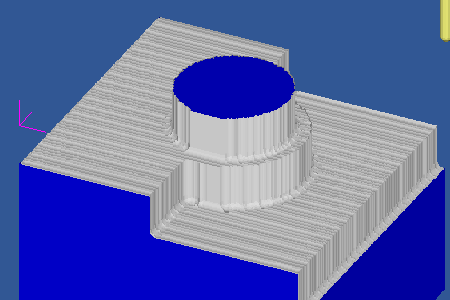

# 3D Toolpath Fundamentals

The last post I wrote here covered a common support question I get for the [CNC Software (MeshCAM)](http://www.grzsoftware.com) that I develop- ["How to choose a stepover value"] (http://www.cnccookbook.com/CCCNCMillFeedsSpeedsStepover.htm).  In a roundabout way, that leads into another common support question- "Why are there so many toolpath types and which one do I pick?"

There are a couple of ways to approach this question- the boring mathematical approach or just show some pictures and try to point out the characteristics of various toolpaths.  We'll do the latter and try to gain an intuitive understanding of the concepts involved.  We'll also simulate some toolpaths using the excellent [Cutviewer CNC simulator](http://www.grzsoftware.com/cutviewer).

## Differences Between 2D and 3D Machining

The first thing to discus are the ways 3D toolpaths differ from 2D toolpaths.  2D toolpaths are used almost exclusively to machine parts that are prismatic- that is, all of the surfaces of the part are horizontal or vertical. 

3D toolpaths are used to machine parts that are more freeform- they may have not have any perfectly vertical or horizontal surfaces.

The image below shows a 3D part on the left and a prismatic part on the right.

## Roughing vs. Finishing

An important 2D/3D difference for CAM programs is that 3D machining is frequently divided into a very distinct roughing and finishing stage. The bulk of the stock material is removed by the roughing toolpath as quickly as possible, although it may leave a poor quality surface.   Finishing toolpaths are used to remove a small amount of material and to give the part the desired surface quality in the least amount of time.

2D toolpaths also use a roughing and finishing pass but they are often combined into a single operation.  For instance, a pocket may be cut slightly undersize and then cut to the final dimension on a final full-depth pass.

##Roughing

In many cases 3D roughing passes are very similar to the pocket toolpaths used in 2D machining. The model is divided into a number slices that are each pocket-machined to leave the model behind.

The image above shows a parallel roughing toolpath, also called a zig-zag toolpath.  Like normal 2D pocketing toolpaths, you generally also have options like offset toolpaths:

The parallel and offset toolpaths shown above are based on standard 2D pocket toolpaths where the Z level is locked on each slice.  This leads to the problem below where lots of material remains uncut:

We can reduce this greatly if we project each slice down onto the model so that the Z level is allowed to follow the contours of the part.

When we look at the simulation we get:

Looking at the output it may not be immediately clear why you'd ever choose the flat version.  There is, of course, one big reason that you might prefer a flat toolpath- it will often cut faster because the machine does not have to move the Z axis up and down as it cuts.  The exact speed difference depends completly on your model, your machine, and your feedrates.   

My rule of thumb is this:  if I'm cutting a soft material, like Renshape or foam, where I can use high feedrates and not load the machine, then I prefer a flat roughing toolpath.  The extra stock leftover will not be a problem for the finishing pass to remove and I like the faster machining time.

If, however, I'm cutting a hard material, like metal, then I prefer a 3D roughing toolpath.  The odds are that my machining time will be limited by my feedrates and I prefer to have a small, even skin left behind for the finishing pass.

After roughing, the stock should have the majority of the excess material removed.  We can now move on to finishing toolpaths where the part will be cut to final dimensions with an acceptable surface finish. 

## Three Fundamental 3D Finishing Toolpaths

There are three bread-and-butter 3D toolpaths- parallel, waterline (sometimes called z-level) and pencil.  

We'll apply those toolpaths to the model shown below:

What may or may not be obvious from that image is that there are three distinct parts of a 3D model that need to be machined in different ways, the flat areas, the steep areas, and the corners.

## Parallel Finishing

Parallel finishing is similar to a 2D zig-zag pocket toolpath that has been projected down on to a 3D part.

From above everything looks good but when we look at a side view the potential problems begin to appear.

Take a look at the part with the arrow- the stepover seems to get further apart relative to distance along the surface.  If we load the gcode into a [CNC simulator](http://www.grzsoftware.com/cutviewer/) then we get the following:

This gives us observation number one- parallel finishing is best used to machine the flat or shallow parts of a model but it does a relatively poor job on the steep parts.

An obvious answer to this limitation is, "Well, just decrease the stepover to get better coverage on the steep part."  Certainly this will work but it leads to a much longer toolpath with a corresponding increase in machining time.  There must be a better option...

## Waterline Finishing
Waterline machining slices the model into many horizontal slices and creates a toolpath that traces each one. The distance between the slices is called the stepdown, which is analogous to the stepover in parallel finishing.  In many cases I use almost the same value for both.

Lets take a look at the same model from above with a waterline path:

Now we're definitely getting good coverage on the vertical part.  What about the flat/shallow parts shown by the arrows?  We're getting very little coverage there- so little, in fact, that a simulation would be almost illegible with all of the uncut stock in the way. 

Based on this we can make another observation- waterline finishing is good for steep or vertical parts but bad for shallow parts.

## Combination Parallel/Waterline Finishing

Many CAM programs that offer both parallel and waterline machining also have a way to limit their use to specific areas based on the surface angles.  Below is a screenshot of a toolpath from MeshCAM with a threshold angle of 45 degrees.  Anything below 45 is machined with parallel, anything steeper is waterline.

A simulation shows only one problem area:

The corners could use a little more cleanup and it would be easier to have the mill do it rather than us doing it manually.   

## Pencil Finishing

Pencil finishing has a single purpose- trace the cutter along sharp concave corners to clean them up.  Outside corners, or convex corners, are machined just fine using a combination of parallel and waterline so the pencil finish doesn't do much there.

Generally there are no settings to configure for pencil machining; just set a feedrate, a tool, and turn it on.  Here's what it looks like:

When we add the pencil path to the parallel-waterline combination above we get the following:

Because pencil paths a short compared to parallel or waterline it is almost always worth enabling them if you have a part with sharp concave corners.

## Conclusion

So here are the rules of thumb for 3D machining-

1. If you want the best finish in the least amount of time, you likely want to use a combination of parallel finishing, waterline finishing, and pencil finishing.
2. Machine all flat/shallow areas with parallel finishing.
3. Machine all steep/vertical areas with waterline finishing.
4. Start with the parallel stepover and waterline stepdown set to the same value.
5. Clean up the corners with a pencil pass.

One of the biggest mistakes that new MeshCAM users make, and I assume that this applies to most new CAM users, is to only use parallel machining to finish a part.  While this will work, it almost always leads to excessive machining time or a substandard finish quality.

## P.S. - High-End Alternatives

 Some of you are thinking that I'm leaving out the more exotic alternatives that combine characteristics of waterline and parallel into a single toolpath, namely the "constant scallop" toolpath and it's derivatives.  
 
 
 
 The image above is from MasterCAM and it shows a toolpath with a more-or-less constat stepover across the model even as the surface transitions from flat to vertical.  These toolpaths can be efficient but they are very difficult to develop and maintain so they exist only in CAM software costing several thousand dollars.  

